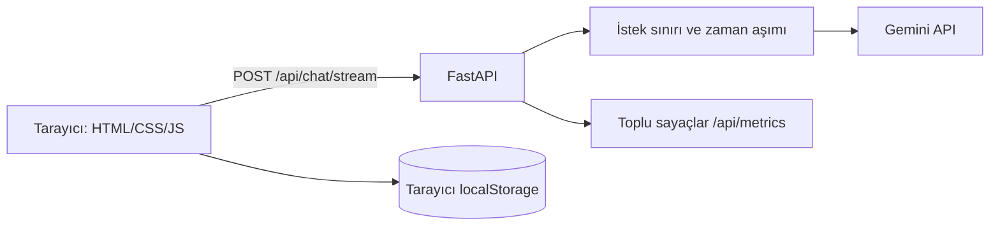

# RetroChat 98 / FutureChat 2058

1998 internet kültürü ile kurgusal bir 2058 geleceği arasında geçiş yapılan, Gemini destekli Türkçe sohbet deneyimi. Aynı soruyu iki döneme sorup yanıtları yan yana karşılaştırabilirsiniz.

> **2058 modu bir gelecek kurgusudur.** Yanıtları gerçekleşmiş olay veya doğrulanmış öngörü olarak kullanmayın.

## Kısa demo

- [Kısa kullanım videosu](demo/retrochat-demo.mp4)
- [Masaüstü karşılaştırma ekranı](demo/desktop.png)
- [Mobil karşılaştırma ekranı](demo/mobile.png)
- [2058 görünümü](demo/future.png)

Demo medyası `scripts/capture_demo.py` ile örnek yanıtlar kullanılarak üretildi; gerçek Gemini çıktısı değildir. Canlı ürünü kullanmak için kendi API anahtarınız gerekir.

## Özellikler

- 1998 ve 2058 kişilikleri arasında geçiş; her dönemin sohbeti ayrı tutulur.
- Aynı sorunun iki dönemdeki yanıtını eş zamanlı karşılaştırma.
- Karşılaştırmada konu seçimi ve iki yanıt tamamlanınca 1998–2058 arasındaki üç kurgusal dönüm noktasını anlatan zaman kapsülü.
- Tamamlanan karşılaştırmayı cihazın paylaşım menüsüyle paylaşma; destek yoksa kopyalama, ayrıca metin veya PNG olarak indirme.
- Akış hâlinde görünen yanıtlar, bekleyen isteği durdurma, anlaşılır hata ve tek tıkla tekrar deneme.
- Bu cihazda saklanan sohbetler; yeni sohbet açma, eski sohbeti seçme ve silme.
- Kayıtlı sohbetleri başlık veya mesaj içeriğinde arama; tüm sohbetleri JSON ya da metin dosyası olarak indirme.
- Tamamlanan yanıtlarda döneme uygunluk, yarım kalma ve tekrar için tek seçimlik geri bildirim; sunucuya yalnızca seçilen kategori gönderilir.
- Önceki 2030 sohbetleri arşiv etiketiyle korunur; yeni 2058 yanıtlarına eski dönem konuşması bağlam olarak gönderilmez.
- Örnek sorular, mobil düzen, klavye kullanımı, ekran okuyucu duyuruları ve azaltılmış hareket desteği.
- Bu cihazda saklanan okuma tercihleri: yazı boyutu, hareketi azaltma ve uzun yanıtları okunabilir parçalara ayırma.
- Sunucuda istek sınırı, zaman aşımı, kodlu hatalar ve mesaj içeriği toplamayan ölçümler.
- Model token sınırına ulaşırsa yanıtı devam ettirme; tamamlanamayan yanıtı bitmiş gibi kaydetmeme.

## Yerelde çalıştırma

```powershell
python -m venv .venv
.\.venv\Scripts\Activate.ps1
python -m pip install -r requirements-dev.txt
Copy-Item .env.example .env
```

`.env` içindeki `GEMINI_API_KEY` değerini ayarlayın. Anahtar yalnızca sunucuda okunur.

```powershell
uvicorn app.main:app --reload
```

Ardından `http://127.0.0.1:8000` adresini açın. İlk ekranda örnek sorulara basabilir veya **İki dönemi karşılaştır** düğmesini kullanabilirsiniz. Sohbetler tarayıcının `localStorage` alanına yazılır; aynı cihazdaki başka kullanıcılar bu tarayıcı profilini paylaşırsa sohbetleri görebilir. **Bu sohbeti sil** düğmesi ilgili kaydı kaldırır. Sunucuda sohbet geçmişi saklanmaz; Gemini isteğini oluşturmak için son 12 mesaj tarayıcıdan gönderilir.

## Mimari



`/api/chat/stream` Server-Sent Events biçiminde `chunk`, `done` ve `error` olayları döndürür. Karşılaştırma iki ayrı istek gönderir; sohbet geçmişini değiştirmez. `/api/chat` önceki JSON sözleşmesi için korunmuştur. `GET /api/health` temel canlılık kontrolüdür.

Hata yanıtlarında `detail.code` ve `detail.message` alanları bulunur. Kodlar: `not_configured`, `invalid_api_key`, `upstream_forbidden`, `upstream_unreachable`, `rate_limited`, `upstream_busy`, `upstream_timeout`, `upstream_error`. Akış başladıktan sonraki hatalar HTTP gövdesinde `event: error` olarak iletilir.
Genel `upstream_error` yanıtı, tanı için yalnızca istisna türünü (`error_type`), oluştuğu dosya/işlev/satırı (`error_origin`) ve varsa sayısal sağlayıcı kodunu (`provider_code`) içerir; sağlayıcının ham hata metni veya anahtar yanıtlanmaz.

`POST /api/events` yalnızca `page_view`, `chat_started`, `retry`, `comparison_started` ve üç `feedback_*` olay adını kabul eder; mesaj içeriğini reddeder. `GET /api/metrics` bu sayaçları, toplam kabul edilen sohbet isteklerini, başarıyı, hatayı, zaman aşımını, ortalama yanıt süresini ve sayfa görüntülemesi başına sohbet başlatma ile istek başına tekrar deneme oranlarını döndürür. Bir sayfa görüntülemesinde birden fazla yeni sohbet açılabildiği için ilk oran 1'i aşabilir. Ölçümler yalnızca bellektedir; süreç yeniden başlayınca sıfırlanır. Soru ve yanıt metinleri ölçümlere veya uygulama loglarına yazılmaz. İstek sınırına takılan çağrılar kabul edilen sohbet isteği sayısına dahil değildir.

## Ayarlar ve yayımlama

| Değişken | Açıklama | Varsayılan |
|---|---|---|
| `GEMINI_API_KEY` | Zorunlu Gemini anahtarı | Yok |
| `GEMINI_MODEL` | Birincil model | `gemini-flash-latest` |
| `GEMINI_FALLBACK_MODEL` | 503 durumunda yedek model | `gemini-3.6-flash` |
| `CHAT_RATE_LIMIT` | IP başına dakikalık sohbet isteği | `20` |
| `CHAT_TIMEOUT_SECONDS` | Yanıt için üst süre | `30` |

Üretimde HTTPS arkasında `uvicorn app.main:app --host 0.0.0.0 --port 8000` komutuyla çalıştırın ve anahtarı barındırma ortamının gizli değişkenlerinde tutun. Mevcut istek sınırı ve ölçümler **süreç başına bellekte** tutulur; birden fazla sunucu örneği için paylaşılan bir depo ve merkezi ölçüm sistemi gerekir. İstemcide durdurulan bir istek, sağlayıcıya ulaşmışsa kullanım maliyeti doğurabilir.

## Test ve demo üretimi

```powershell
python -m pytest tests -q -p no:cacheprovider
python scripts/capture_demo.py
```

Tarayıcı testleri Chromium gerektirir; gerekirse `python -m playwright install chromium` çalıştırın. Demo videosunu yeniden üretmek için FFmpeg gerekir. API ve model hizmeti testleri dış API'ye bağlanmaz; tarayıcı testleri akış yanıtlarını kontrollü olarak taklit eder.
